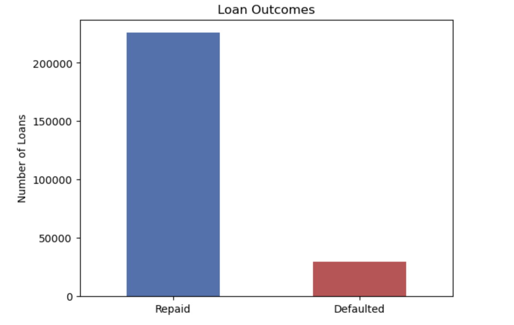
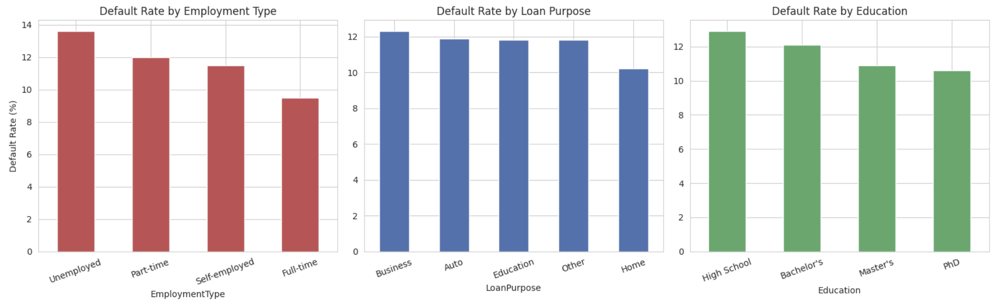
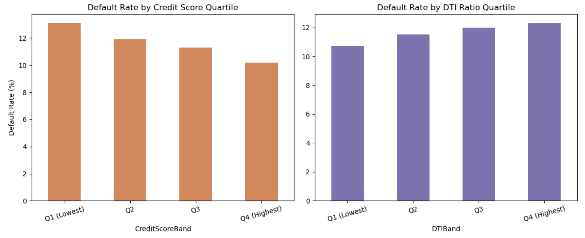
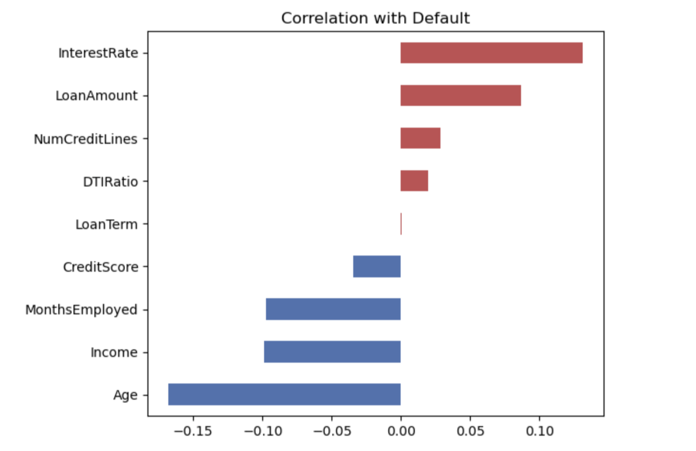
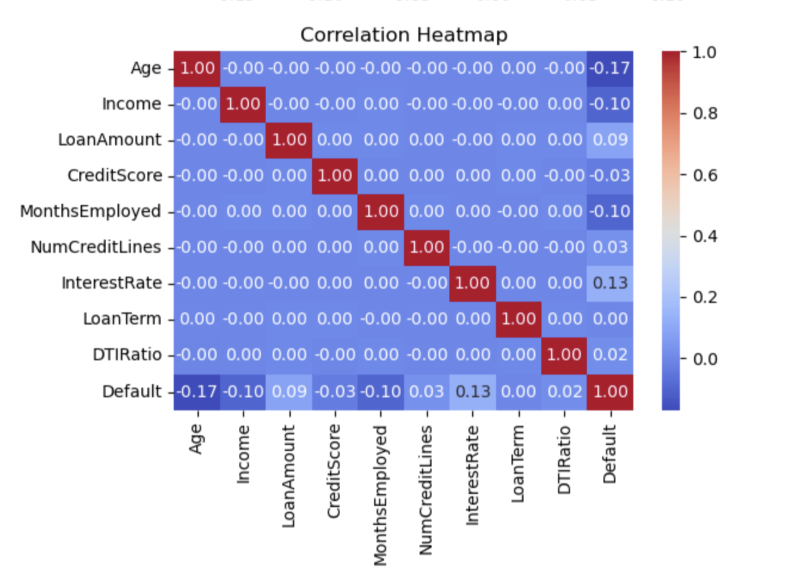
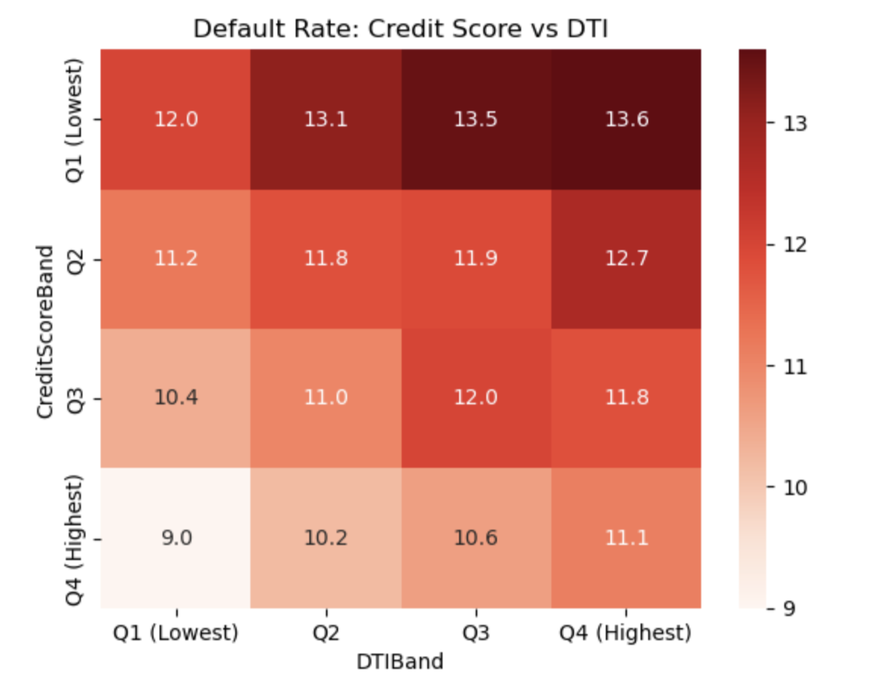
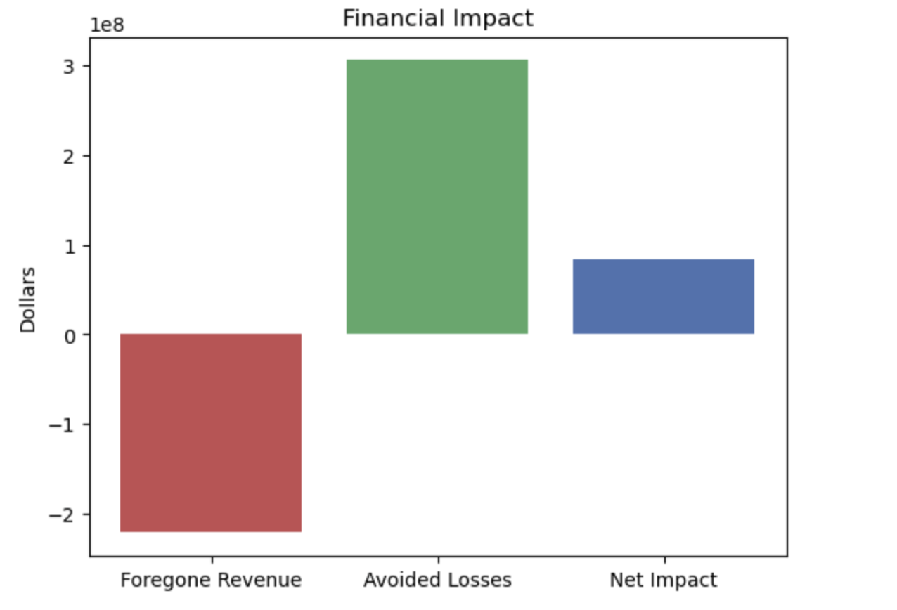

# Loan Default Analysis — Finance / Credit Risk Analytics Project

A Python analysis of 255,000 real loans, looking at who is likely to default, what factors matter most, and what happens financially if the company gets stricter about who it approves.

## Business Problem

When a lender approves a loan, there's always a risk the borrower won't pay it back. Say no too often, and you lose good customers. Say yes too often, and you lose money on defaults. This project looks at real loan data to figure out where that balance should be.

## Dataset

- **Source:** [Loan Default Prediction Dataset](https://www.kaggle.com/datasets/nikhil1e9/loan-default) (Kaggle, real data)
- **Size:** 255,347 loans, 18 features, zero missing values, zero duplicate rows
- **Key columns:** Age, Income, LoanAmount, CreditScore, MonthsEmployed, InterestRate, DTIRatio, Education, EmploymentType, LoanPurpose, Default

## Project Structure

```
├── README.md
├── Loan_Default_Analysis.ipynb   # Main analysis notebook
├── loan_default.csv               # Source dataset
├── images/                       # Chart previews used in this README
    ├── default_rate_overview.png
    ├── employment_purpose_education.png
    ├── credit_dti_quartiles.png
    ├── correlation_bar.png
    ├── correlation_heatmap.png
    ├── risk_pivot_heatmap.png
    └── financial_tradeoff.png
```

## Methodology

Each question in the notebook follows the same structure: **Business Problem → Concept → Code → Result → Insight → Recommendation.** A data quality check (`.head()`, `.info()`, `.isnull().sum()`, `.duplicated().sum()`) runs first, before any analysis begins.

| # | Question | Technique Used |
|---|----------|-----------------|
| 0 | Is the data clean? | `.head()`, `.info()`, `.isnull().sum()`, `.duplicated().sum()` |
| 1 | What's the overall default rate? | `value_counts(normalize=True)` |
| 2 | Which employment types / loan purposes default most? | `groupby()`, sorting |
| 3 | Does credit score or debt-to-income (DTI) ratio predict default? | `pd.qcut()` quartile bucketing |
| 4 | What factors correlate most with default? | `corr()`, heatmap |
| 5 | Where do credit score and DTI combine to create the highest risk? | `pivot_table()` |
| 6 | What's the financial trade-off of tightening approval criteria? | Business-rule simulation + revenue/loss modeling |

## Preview

**Q1 — Overall portfolio outcome:**



> **Insight:** 11.6% of loans in this portfolio defaulted (29,653 of 255,347) — a realistic rate for consumer lending, but not yet broken down by risk segment.

---

**Q2 — Default rate by employment type, loan purpose, and education:**



> **Insight:** Unemployed borrowers default at 13.6% vs. 9.5% for full-time employees — the largest single-variable gap in the whole dataset. Business-purpose loans (12.3%) are riskier than Home loans (10.2%).

---

**Q3 — Default rate by credit score and DTI ratio quartile:**



> **Insight:** Both factors move in the expected direction, but the effect is modest on their own — only a ~2–3 percentage point spread across the full range of either credit score or DTI ratio.

---

**Q4 — What correlates most with default:**





> **Insight:** Age (-0.17) is the strongest linear correlate — younger borrowers default more. CreditScore's correlation is surprisingly weak (-0.03) despite the real quartile-level pattern seen in Q3, showing why a single correlation number can understate a non-linear relationship.

---

**Q5 — Where credit score and DTI combine to create the highest risk:**



> **Insight:** The riskiest combination (lowest credit score + highest DTI) hits 13.6% default — nearly 4.6 points above the safest combination (9.0%), a much stronger signal than either factor produces alone.

---

**Q6 — The financial trade-off of tightening approval criteria (key result):**



> **Insight:** Rejecting the entire high-risk segment (15,671 loans) forgoes $221.1M in interest revenue from good loans, but avoids $305.3M in default losses — a **net positive of $84.2M**, because a default's cost (full principal) is much larger than one year of interest on a performing loan.

## Key Findings

- **Overall default rate: 11.6%** (29,653 of 255,347 loans)
- **Unemployed borrowers default the most (13.6%)**; full-time employees the least (9.5%) — the largest single-variable gap found in the whole analysis
- **Business-purpose loans carry the highest risk (12.3%)**; home loans the lowest (10.2%)
- **Credit score and DTI ratio both move in the expected direction, but only modestly on their own** (~2–3 percentage point spread each) — a useful, honest finding that pushes back on the common assumption that credit score alone is a strong predictor
- **Age is the strongest linear correlate with default** (younger borrowers default more) — a stronger correlation than credit score's, which is a genuinely counter-intuitive result worth highlighting
- **Combining credit score and DTI quartiles produces a much stronger risk signal** (13.6% vs. 9.0%) than either factor alone — a clear example of compounding risk factors
- **Tightening approval for the highest-risk combined segment** (lowest credit score + highest DTI) is projected to **net approximately +$84 million**, since avoided default losses (full loan principal) outweigh the foregone interest revenue from the good loans within that same segment

## Business Recommendation

Credit score and debt level don't predict default well on their own, but combining them works much better. The clearest financial move is to reject loans where a borrower has both a low credit score and high debt — not just one or the other. Doing that on this dataset would have saved an estimated $84 million.

## Tools Used

- Python (pandas, NumPy)
- Matplotlib, Seaborn (visualization)
- Jupyter Notebook

## How to Run

```bash
pip install pandas numpy matplotlib seaborn jupyter
jupyter notebook Loan_Default_Analysis.ipynb
```

## Why No Machine Learning?

Every finding here uses transparent, explainable techniques — `groupby`, quartile bucketing, pivot tables, correlation, and a business-rule-based financial simulation — deliberately chosen so every dollar figure and risk finding can be defended and understood by a non-technical lending or credit-policy stakeholder, before any predictive model would be introduced.

---

## 👤 Author

Sheena 📧 [sheena.charaya@gmail.com](mailto:sheena.charaya@gmail.com) | 🔗 [LinkedIn](https://linkedin.com/in/sheena-charaya)

*Part of a data analytics portfolio.*

